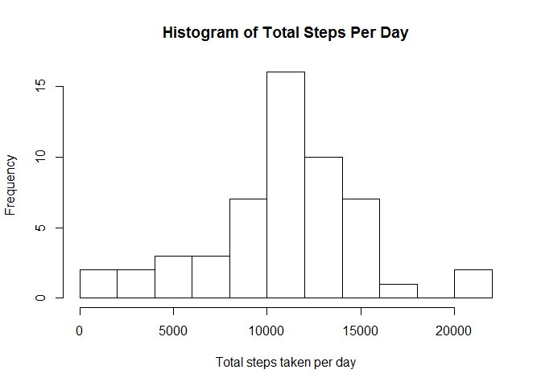
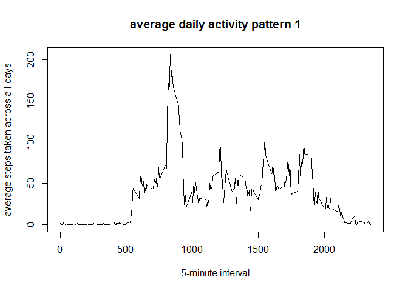
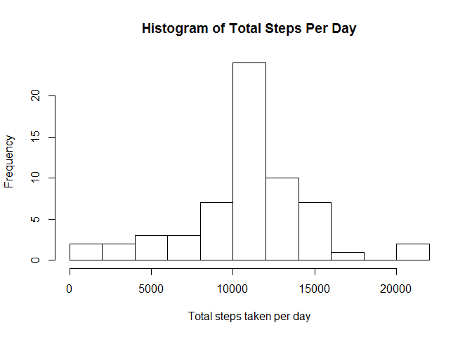
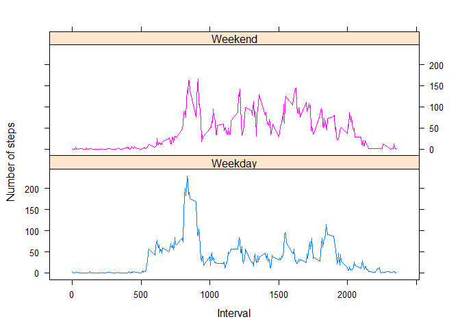

# Reproducible Research: Peer Assessment 1


## Loading and preprocessing the data  

1.Load the data

```r
activity <- read.csv("activity.csv")
```

2.Process/transform the data

```r
activity$date <- as.Date(activity$date)
summary(activity)
```

```
##      steps             date               interval     
##  Min.   :  0.00   Min.   :2012-10-01   Min.   :   0.0  
##  1st Qu.:  0.00   1st Qu.:2012-10-16   1st Qu.: 588.8  
##  Median :  0.00   Median :2012-10-31   Median :1177.5  
##  Mean   : 37.38   Mean   :2012-10-31   Mean   :1177.5  
##  3rd Qu.: 12.00   3rd Qu.:2012-11-15   3rd Qu.:1766.2  
##  Max.   :806.00   Max.   :2012-11-30   Max.   :2355.0  
##  NA's   :2304
```


## What is mean total number of steps taken per day?  

For this part of the assignment, we will ignore the missing values in the dataset.


1. Calculate the total number of steps taken per day  


```r
activity_sum <- aggregate(steps ~ date, data = activity, FUN = function(x) c(sum = sum(x)))
```

2. Make a histogram of the total number of steps taken each day  


```r
hist(activity_sum$steps, main = "Histogram of Total Steps Per Day", xlab = "Total steps taken per day", breaks = 10)
```

 

3. Calculate and report the mean and median total number of steps taken per day  

```r
activity_sum_mean <- mean(activity_sum$steps)
activity_sum_median <- median(activity_sum$steps)
```
mean total number of steps taken per day    : 10766.19  
median total number of steps taken per day  : 10765  

## What is the average daily activity pattern?  
1. Make a time series plot (i.e. type = "l") of the 5-minute interval (x-axis) and the average number of steps taken, averaged across all days (y-axis)  

```r
activity_sum2 <- aggregate(steps ~ interval, data = activity, FUN = function(x) c(mean = mean(x)))

plot(steps ~ interval, data = activity_sum2, type = "l", main = "average daily activity pattern 1",
     xlab = "5-minute interval",
     ylab = "average steps taken across all days")
```

 

2. Which 5-minute interval, on average across all the days in the dataset, contains the maximum number of steps?  


```r
max_interval <- activity_sum2$interval[which.max(activity_sum2$steps)]
```
The 5-minute interval with the maximum number of steps is 835  

## Imputing missing values   

1. Calculate total number of missing values in the dataset  

```r
TotalofNA <- sum(is.na(activity$steps))
```
total number of missing values in the dataset is 2304


2. filling in all of  missing values in the dataset. The strategy does not need to be sophisticated. For example, you could use the mean/median for that day, or the mean for that 5-minute interval, etc.
3. Create a new dataset that is equal to the original dataset but with the missing data filled in.

```r
## new dataset to fill the missing values
activity_fill <- activity

## fill missing values with mean
for (row in which(is.na(activity_fill$steps))) {
    activity_fill$steps[row] <- as.numeric(activity_sum2[activity_sum2$interval == activity_fill$interval[row],]["steps"])
}
```


4. Make a histogram of the total number of steps taken each day and Calculate and report the mean and median total number of steps taken per day. Do these values differ from the estimates from the first part of the assignment? What is the impact of imputing missing data on the estimates of the total daily number of steps?

```r
## aggregate based on the new data set.
activity_sum3 <- aggregate(steps ~ date, data = activity_fill, FUN = function(x) c(sum = sum(x)))

hist(activity_sum3$steps, main = "Histogram of Total Steps Per Day", xlab = "Total steps taken per day", breaks = 10)
```

 

```r
## mean and median for the new data set:

activity_sum3_mean <- mean(activity_sum3$steps)
activity_sum3_median <- median(activity_sum3$steps)
```

- values calculated in the first part:  
mean total number of steps taken per day    : 10766.19  
median total number of steps taken per day  : 10765  

- values calculated based on the new data set with NA values filled:  
mean total number of steps taken per day    : 10766.19  
median total number of steps taken per day  : 10766.19  

to answer the above questions, the result show that there was a shift in the median and no change on mean value.

## Are there differences in activity patterns between weekdays and weekends?  
  
1. Create a new factor variable in the dataset with two levels - "weekday" and "weekend" indicating whether a given date is a weekday or weekend day.


```r
activity_fill$daytype <- as.factor(ifelse(weekdays(activity_fill$date) %in% c("Saturday", "Sunday"), 
    "Weekend", "Weekday"))
```


2. Make a panel plot containing a time series plot (i.e. type = "l") of the 5-minute interval (x-axis) and the average number of steps taken, averaged across all weekday days or weekend days (y-axis). 


```r
library(lattice)
activity_sum4 <- aggregate(steps ~ interval + daytype, activity_fill, FUN = function(x) c(mean = mean(x)))

xyplot(steps ~ interval | daytype, activity_sum4,layout = c(1, 2), type = "l", group = daytype, 
       xlab = "Interval",
       ylab = "Number of steps")
```

 

